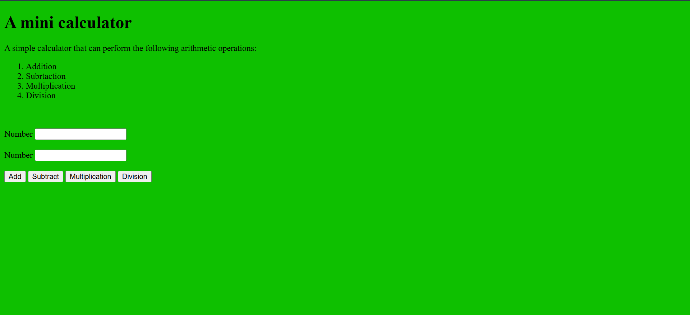
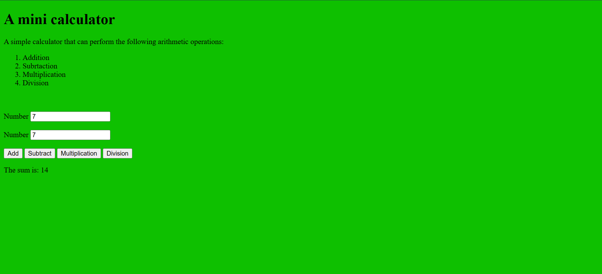

---
##🧮 Mini Calculator

A simple web-based calculator that performs basic arithmetic operations

- ➕ Addition  
- ➖ Subtraction  
- ✖️ Multiplication  
- ➗ Division  

This project is ideal for beginners learning JavaScript, HTML, and CSS fundamentals. 
It validates input and provides clear feedback when invalid numbers are entered.

---

## 🚀 Features

- Input fields for two numbers  
- Buttons to perform each arithmetic operation  
- Displays result or error message  
- Lightweight and responsive design  

---

## 🛠️ How to Use

1. Enter two valid numbers in the input fields.  
2. Click one of the operation buttons: `Add`, `Subtract`, `Multiply`, or `Divide`.  
3. The result will be displayed below the buttons.  
4. If inputs are invalid, an error message will prompt: **"Please enter valid numbers."**

---

## 📁 File Structure

- `simpleCalculator.html`: Contains the calculator layout and buttons  
- `script.js`: Handles input validation and arithmetic logic  

---

## 📸 Preview

---

## 💡 Future Improvements

- Add keyboard support  
- Include decimal precision control  
- Extend to scientific operations (square root, exponentiation, etc.)  
- Mobile-first redesign with Tailwind or ShadCN integration  

---

## 🙌 Acknowledgments

Thanks to the open-source community and learners who inspire simple yet powerful tools like this. Built with care by [Jim Hope](https://github.com/HopefulJim7).

---

## 📝 License

This project is licensed under the **MIT License**.
